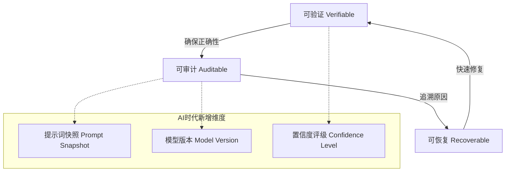

# V.A.R. 三角模型 - AI-Native工程治理框架



## 核心理念

**"AI生成的代码必须比人工代码更可信、更可追溯、更可控"**

V.A.R.框架是专为AI-Native开发设计的工程治理体系，通过三个互锁维度确保AI代码的质量和安全性：

| 维度 | 核心问题 | AI时代新挑战 | 解决目标 |
|------|----------|--------------|----------|
| **Verifiable** | "代码正确吗？" | AI幻觉、不可预测性 | 让Bug在部署前自杀 |
| **Auditable** | "为什么这样写？" | 黑箱决策、上下文丢失 | 给代码装上黑匣子 |
| **Recoverable** | "出事了怎么办？" | 快速迭代、数据风险 | 让灾难成为可控事件 |

## 快速开始

### 5分钟集成

```bash
# 1. 复制配置
cp -r docs/ai-governance/var-framework/configs/* ./

# 2. 安装依赖
npm install --save-dev fast-check @fast-check/vitest

# 3. 启用Git钩子
cp docs/ai-governance/var-framework/scripts/pre-commit .git/hooks/
chmod +x .git/hooks/pre-commit

# 4. 初始化决策日志
echo "# ADRs" > DECISIONS.md
```

### 13天实施路线图

```
Week 1: Verifiable (防错)
├── Day 1-2: 建立类型契约 (Human-Only Types)
├── Day 3-5: 双轨验证 (Shadow Testing)
└── Day 6-7: Property-Based Testing

Week 2: Auditable (追溯)
├── Day 8-9: 元数据嵌入 (AI Headers)
├── Day 10-11: PromptDB建立
└── Day 12-13: 决策日志 (ADRs)

Week 3: Recoverable (兜底)
├── Day 14-15: 特性开关 (Feature Flags)
├── Day 16-18: 数据迁移方案
└── Day 19-20: 回滚演练
```

## 核心原则

### 1. 可验证 (Verifiable)

> **"不可测试的代码不可提交，不可测的AI生成代码不可信任"**

- **契约先行**: 人工编写Interface，AI只实现不修改
- **双轨验证**: AI版本与人工版本并行，对比输出
- **属性测试**: 使用fast-check验证不变式

### 2. 可审计 (Auditable)

> **"3年后能回答'为什么这样写'，并定位到当时的决策者"**

- **元数据嵌入**: AI代码强制头部注释
- **PromptDB**: 提示词版本化管理
- **决策日志**: ADR记录关键架构决策

### 3. 可恢复 (Recoverable)

> **"任何时刻，我都能在5分钟内回到上一个稳定状态，且不丢失数据"**

- **特性开关**: 一键切换新旧版本
- **数据备份**: 物理备份+逻辑审计
- **环境固化**: Dockerfile锁定依赖版本

## 验证清单

提交代码前检查：

- [ ] **Verifiable**: 是否有测试覆盖AI代码边界条件？
- [ ] **Verifiable**: TypeScript编译是否零错误零警告？
- [ ] **Auditable**: AI生成文件是否有`@prompt-hash`注释？
- [ ] **Auditable**: Git提交是否包含`[AI-assisted]`标签？
- [ ] **Recoverable**: 是否能在5分钟内回滚？
- [ ] **Recoverable**: 数据迁移是否有回滚脚本？

## 与AI治理模板的关系

```
V.A.R.框架 (方法论)
       │
       ├──► medical-domain-template (医疗场景实现)
       │      - 最高严格度HIPAA合规
       │      - Shadow Mode 0%流量开始
       │
       └──► general-software-template (通用场景实现)
              - 平衡效率与质量
              - Blue-Green部署
```

## 许可证

MIT License - 可自由用于商业项目。

---

**🔗 相关文档**:
- [详细实施指南](./IMPLEMENTATION_GUIDE.md)
- [5分钟快速开始](./QUICK_START.md)
- [验证清单](./CHECKLIST.md)
