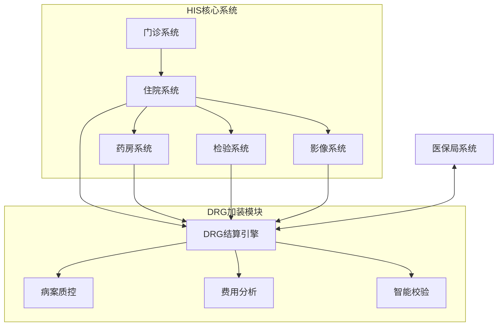
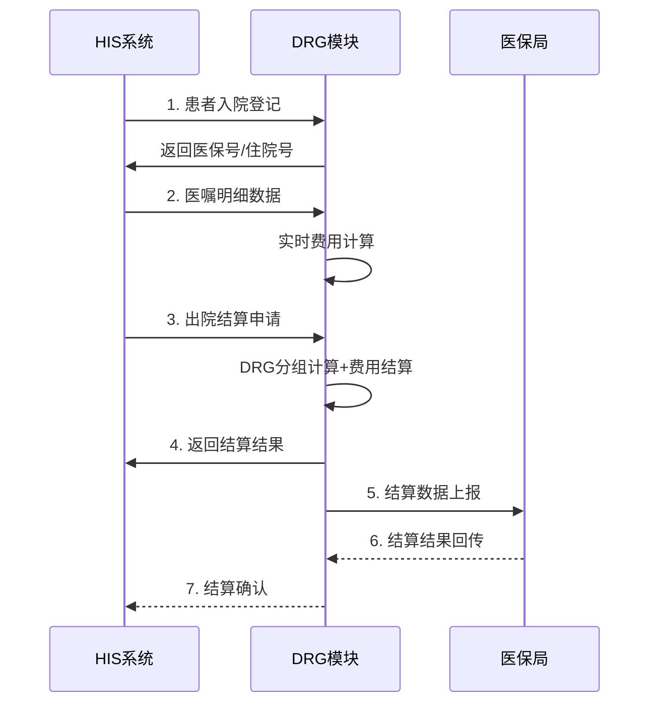
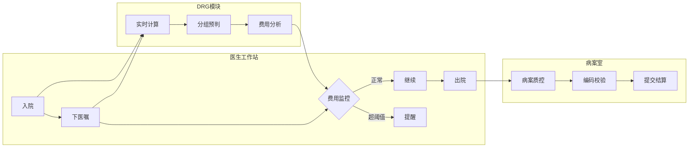
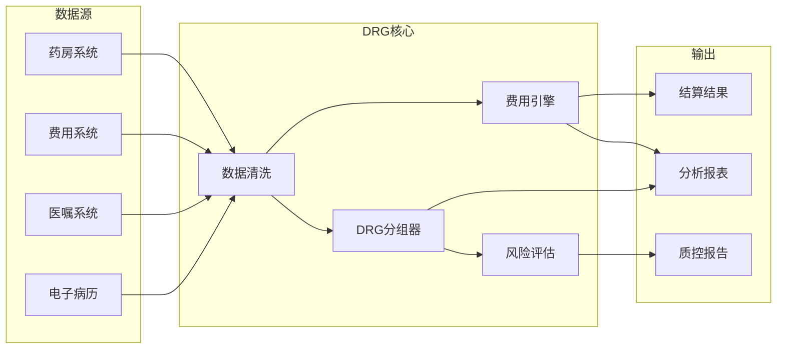

# DRG作为HIS加装功能 - 完整架构设计文档

## 一、背景定位

DRG（疾病诊断相关分组）医保结算系统本质上是在**医院现有HIS系统基础上叠加的智能结算模块**，而非独立的全新系统。这种"加装"定位决定了它的技术架构必须与HIS深度融合，同时保持一定的独立性。

## 二、DRG在HIS中的角色定位



**核心观点**：DRG是HIS的**增值功能**，不是替代关系

## 三、技术架构分析

### 3.1 加装模式的技术特点

| 维度 | 说明 |
|------|------|
| **集成方式** | 微服务化部署，通过API与HIS对接 |
| **数据依赖** | 读取HIS中的病案数据，不修改原数据 |
| **耦合度** | 松耦合，可独立升级 |
| **部署模式** | 可选择本地部署或云端部署 |

### 3.2 与HIS的数据交互



### 3.3 核心技术实现

```typescript
// DRG作为HIS加装模块的典型集成代码示例

interface HISPatient {
  patientId: string;
  admissionNo: string;
  deptId: string;
}

// DRG模块提供的服务接口
class DRGServiceAdapter {
  
  // 1. 实时费用计算（嵌入HIS医生工作站）
  async calculateRealtimeCost(orders: MedicalOrder[]): Promise<CostPreview> {
    const drgWeight = await this.getDRGWeight(this.currentDRGCode);
    const paymentStandard = drgWeight * this.rate;
    const consumed = orders.reduce((sum, o) => sum + o.amount, 0);
    const remaining = paymentStandard - consumed;
    return { consumed, remaining, percentage: (consumed/paymentStandard)*100 };
  }
  
  // 2. 出院时DRG分组（嵌入HIS出院工作站）
  async performDRGGrouping(caseData: CaseData): Promise<DRGResult> {
    const drgCode = await this.drgGroupingEngine.group(caseData);
    const settlement = await this.settlementCalculator.calculate(caseData, drgCode);
    return { drgCode, settlement };
  }
  
  // 3. 病案质控（嵌入HIS病案室工作站）
  async qualityCheck(medicalRecord: MedicalRecord): Promise<QCResult> {
    return {
      diagnosisValid: this.validateDiagnosis(medicalRecord),
      codingValid: this.validateCoding(medicalRecord),
      riskScore: this.calculateRiskScore(medicalRecord)
    };
  }
}
```

## 四、业务场景分析

### 4.1 DRG嵌入HIS的业务流程



### 4.2 核心业务场景

| 场景 | 位置 | 功能 | 价值 |
|------|------|------|------|
| 入院登记 | 住院登记 | 医保资格校验 | 确保医保身份有效 |
| 医生下医嘱 | 医生工作站 | 实时费用预览 | 帮助医生合理用药 |
| 费用查询 | 护士站 | 科室/患者费用监控 | 成本控制 |
| 出院结算 | 结算窗口 | DRG分组+结算 | 准确结算 |
| 病案质控 | 病案室 | 编码校验+风险评估 | 避免飞检风险 |
| 数据分析 | 管理层 | CMI/费用/效率分析 | 绩效管理 |

## 五、数据流转分析

### 5.1 数据流向图



### 5.2 关键数据实体

```typescript
// DRG模块核心数据模型

// 1. 从HIS同步的患者数据
interface PatientCase {
  patientId: string;
  admissionNo: string;
  admissionDate: Date;
  dischargeDate: Date;
  mainDiagnosis: Diagnosis;
  secondaryDiagnoses: Diagnosis[];
  surgeries: Surgery[];
  dailyCosts: DailyCost[];
}

// 2. DRG计算结果
interface DRGResult {
  drgCode: string;           // ES23
  drgName: string;           // 呼吸系统感染
  weight: number;             // 0.75
  paymentStandard: number;   // 7500元
  actualCost: number;         // 6937元
  costRate: number;           // 92.5%
  hospitalSurplus: number;   // +563元
  riskLevel: 'low'|'medium'|'high';
}

// 3. 质控结果
interface QCResult {
  diagnosisValid: boolean;
  codingQuality: number;     // 0-100
  riskScore: number;         // 0-100
  suggestions: string[];
}
```

## 六、与HIS的集成模式

### 6.1 三种集成模式对比

| 模式 | 特点 | 适用场景 | 复杂度 |
|------|------|----------|--------|
| **紧耦合** | DRG代码直接嵌入HIS | 大型医院统一升级 | 高 |
| **松耦合** | API接口调用 | 中型医院 | 中 |
| **独立部署** | 独立系统，数据同步 | 小型医院/云模式 | 低 |

### 6.2 推荐架构（松耦合）

```
┌─────────────────────────────────────────────────────────┐
│                    医院内网                              │
│  ┌─────────┐    ┌─────────┐    ┌─────────┐            │
│  │ HIS     │    │ 检验    │    │ 影像    │            │
│  │ 系统    │    │ LIS     │    │ PACS    │            │
│  └────┬────┘    └────┬────┘    └────┬────┘            │
│       │              │              │                   │
│       └──────────────┼──────────────┘                   │
│                      ▼                                   │
│              ┌─────────────┐                           │
│              │  数据交换   │  (ETL/接口机)               │
│              │   中间件    │                           │
│              └──────┬──────┘                           │
│                     │                                   │
└─────────────────────┼───────────────────────────────────┘
                      ▼
┌─────────────────────────────────────────────────────────┐
│                   DRG服务域                             │
│  ┌──────────┐ ┌──────────┐ ┌──────────┐               │
│  │ 分组引擎 │ │ 结算引擎 │ │ 质控引擎 │               │
│  └────┬─────┘ └────┬─────┘ └────┬─────┘               │
│       │            │            │                       │
│       └────────────┼────────────┘                       │
│                    ▼                                     │
│              ┌──────────┐                               │
│              │  数据库   │                               │
│              │ (独立实例)│                               │
│              └──────────┘                               │
└─────────────────────────────────────────────────────────┘
                      ▲
                      │ HTTPS API
┌─────────────────────┴───────────────────────────────────┐
│                   医保局                                │
└─────────────────────────────────────────────────────────┘
```

## 七、总结

### 7.1 DRG作为HIS加装模块的核心价值

1. **不破坏现有系统**：通过API接口交互，不修改HIS源代码
2. **快速上线**：可独立部署，不影响医院日常运营
3. **灵活扩展**：功能模块化，可按需选择上线
4. **数据安全**：与医保局直连，减轻HIS压力

### 7.2 技术实现要点

- 采用**适配器模式**对接不同厂商的HIS
- 使用**缓存**提高实时费用计算性能
- 实现**幂等性**保证结算准确性
- 建立**完整日志**便于问题追溯

### 7.3 面试话术

> "DRG系统本质上是在医院现有HIS系统基础上，通过松耦合的微服务架构叠加的智能结算模块。它不替换HIS，而是通过标准API接口读取HIS中的病案、医嘱、费用数据，在DRG模块完成分组计算、费用结算、风险评估后，将结果回传给HIS。整个系统采用适配器模式，可以兼容不同厂商的HIS系统。"
