# 智慧医疗服务平台 - 知识图谱

## 一、核心业务领域图谱

```mermaid
graph TB
    subgraph 患者服务域
        A[患者身份管理] --> A1[建档服务]
        A --> A2[认证服务]
        A --> A3[健康卡服务]
        A1 --> A11[在线建档]
        A1 --> A12[档案查询]
        A1 --> A13[档案更新]
        A2 --> A21[身份认证]
        A2 --> A22[免密签约]
        A3 --> A31[电子健康卡申领]
        A3 --> A32[健康卡同步]
    end

    subgraph 预约挂号域
        B[预约挂号服务] --> B1[资源查询]
        B --> B2[预约管理]
        B --> B3[挂号执行]
        B1 --> B11[院区查询]
        B1 --> B12[科室查询]
        B1 --> B13[医生查询]
        B1 --> B14[排班查询]
        B1 --> B15[号源查询]
        B2 --> B21[预约锁号]
        B2 --> B22[取消预约]
        B2 --> B23[远期预约]
        B3 --> B31[正式挂号]
        B3 --> B32[退号退费]
        B3 --> B33[状态通知]
    end

    subgraph 诊前服务域
        C[诊前服务] --> C1[智能导诊]
        C --> C2[预问诊]
        C1 --> C11[症状导诊]
        C1 --> C12[科室推荐]
        C2 --> C21[问卷填写]
        C2 --> C22[病史推送]
    end

    subgraph 支付结算域
        D[支付结算服务] --> D1[费用查询]
        D --> D2[支付处理]
        D --> D3[医保结算]
        D --> D4[退费管理]
        D1 --> D11[待缴费用]
        D1 --> D12[费用明细]
        D1 --> D13[费用清单]
        D2 --> D21[在线支付]
        D2 --> D22[支付通知]
        D2 --> D23[预结算]
        D3 --> D31[医保上传]
        D3 --> D32[医保结算]
        D4 --> D41[窗口退费]
        D4 --> D42[单边退费]
    end

    subgraph 报告查询域
        E[报告查询服务] --> E1[检验报告]
        E --> E2[检查报告]
        E --> E3[云影像]
        E1 --> E11[检验列表]
        E1 --> E12[检验详情]
        E2 --> E21[检查列表]
        E2 --> E22[检查详情]
        E3 --> E31[影像查看]
        E3 --> E32[影像支付]
    end

    subgraph 病历管理域
        F[病历管理服务] --> F1[就诊记录]
        F --> F2[门诊病历]
        F --> F3[出院小结]
        F --> F4[处方查询]
        F1 --> F11[门诊记录]
        F1 --> F12[住院记录]
        F2 --> F21[病历详情]
        F2 --> F22[病历PDF]
        F3 --> F31[小结查询]
        F3 --> F32[小结PDF]
        F4 --> F41[处方列表]
        F4 --> F42[处方详情]
    end

    subgraph 住院服务域
        G[住院服务] --> G1[住院信息]
        G --> G2[费用管理]
        G --> G3[手术服务]
        G --> G4[出院结算]
        G --> G5[病案服务]
        G1 --> G11[住院查询]
        G1 --> G12[床位信息]
        G2 --> G21[预交金充值]
        G2 --> G22[缴费记录]
        G2 --> G23[每日清单]
        G3 --> G31[手术进度]
        G4 --> G41[出院预结算]
        G4 --> G42[正式结算]
        G5 --> G51[病案复印]
        G5 --> G52[复印支付]
    end

    subgraph 便民服务域
        H[便民服务] --> H1[电子发票]
        H --> H2[物价查询]
        H --> H3[自助开单]
        H --> H4[药品配送]
        H --> H5[检查预约]
        H --> H6[满意度评价]
        H1 --> H11[发票查询]
        H1 --> H12[发票详情]
        H2 --> H21[药品价格]
        H2 --> H22[项目价格]
        H3 --> H31[检查开单]
        H3 --> H32[检验开单]
        H4 --> H41[配送列表]
        H4 --> H42[地址管理]
        H4 --> H43[配送提交]
        H5 --> H51[检查预约]
        H5 --> H52[时段查询]
        H6 --> H61[评价提交]
        H6 --> H62[评价查看]
    end

    A -.-> B
    B -.-> C
    B -.-> D
    D -.-> E
    D -.-> F
    B -.-> G
    D -.-> G
    E -.-> H
    F -.-> H
```

---

## 二、业务流程图谱

### 2.1 预约挂号流程

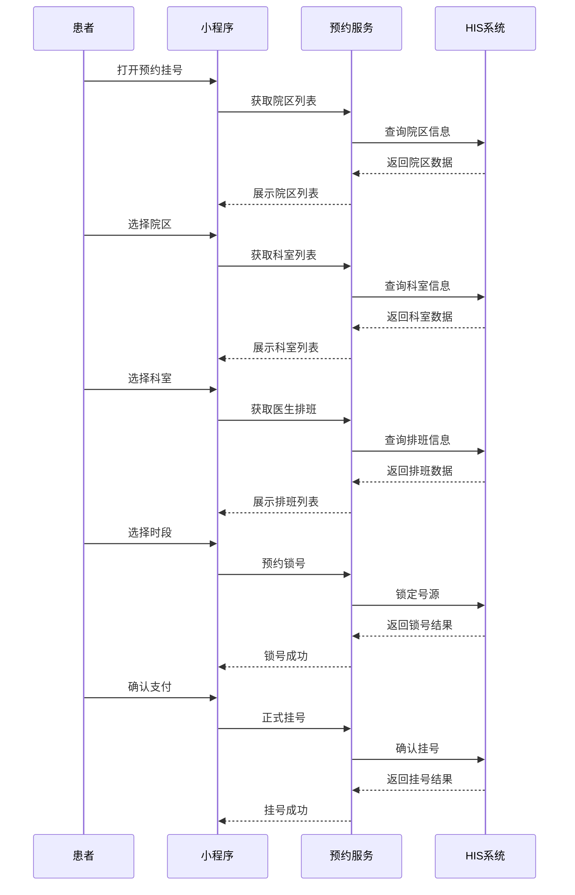

### 2.2 门诊缴费流程

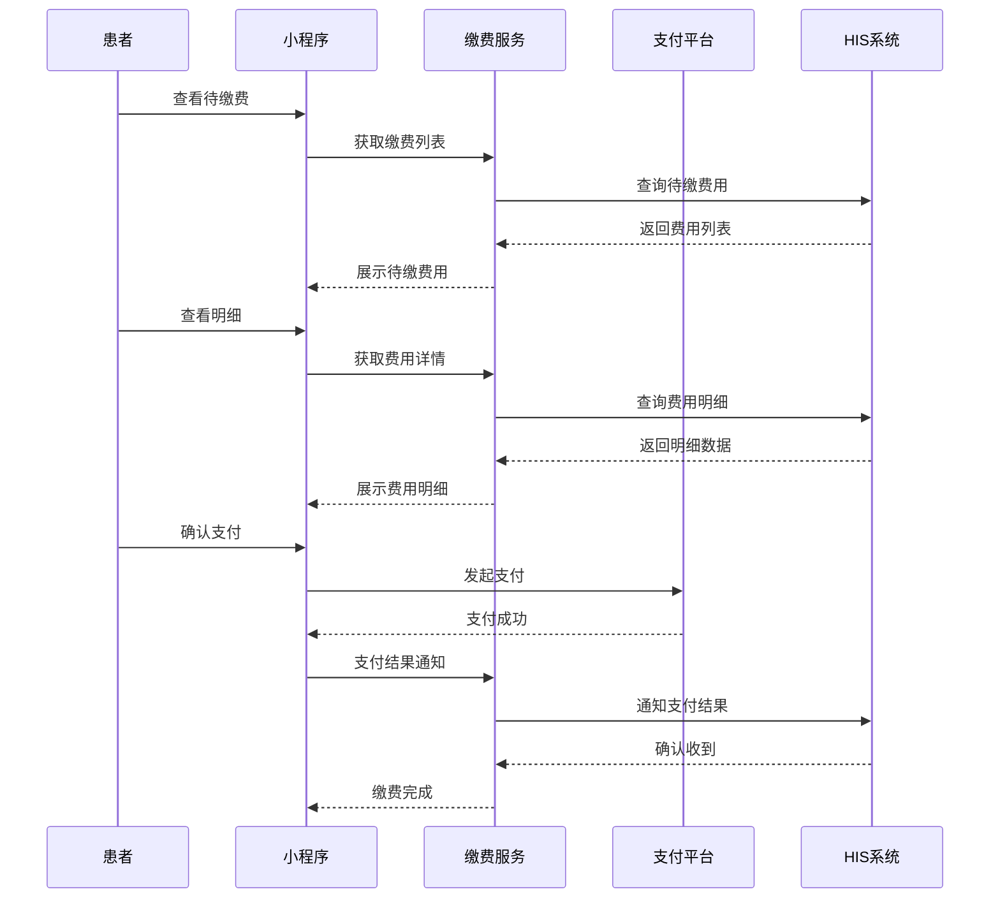

### 2.3 报告查询流程

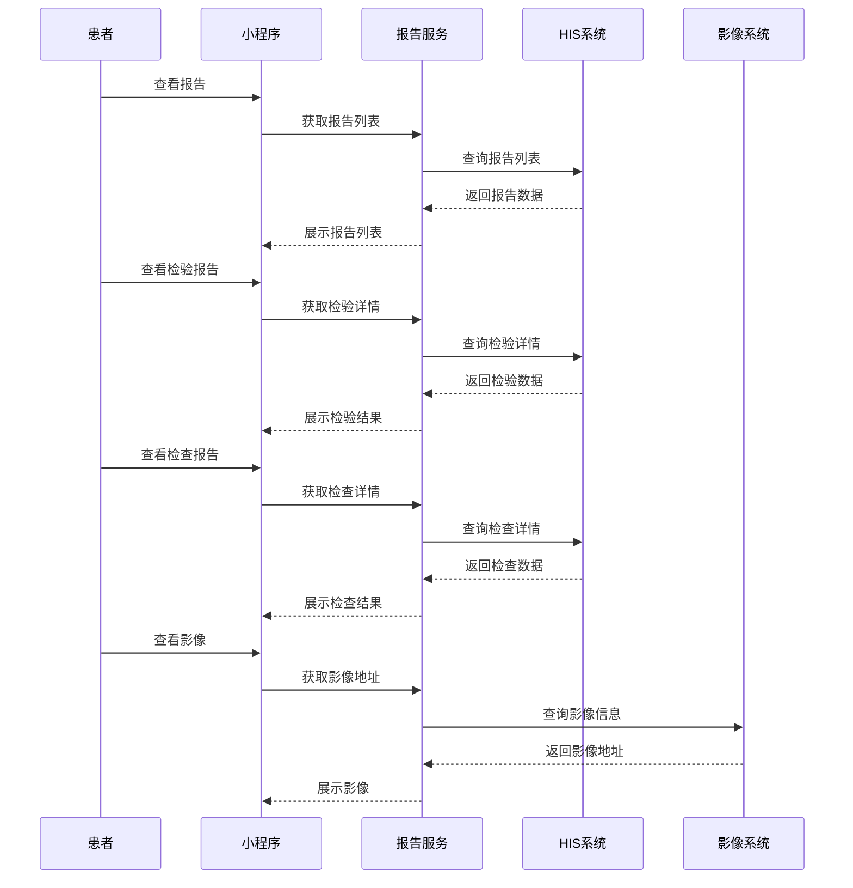

---

## 三、数据流转图谱

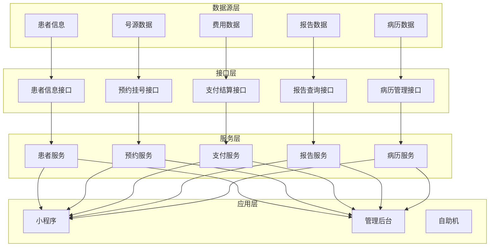

---

## 四、接口依赖关系图谱

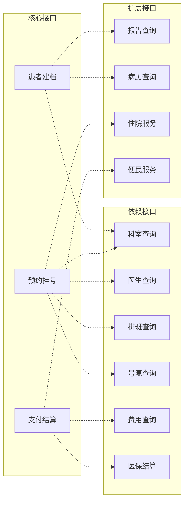

---

## 五、系统交互图谱

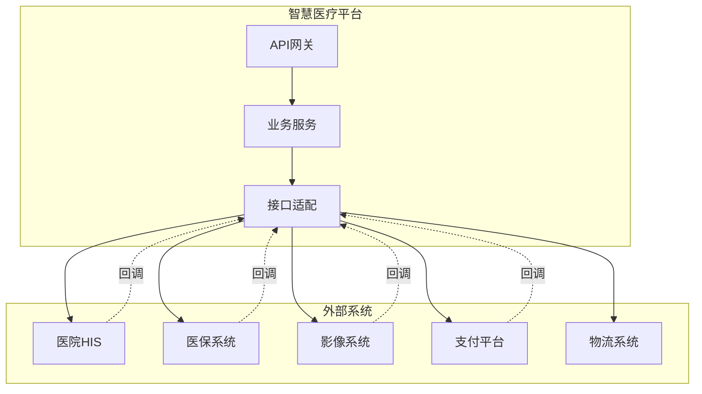

---

## 六、服务调用链路图谱

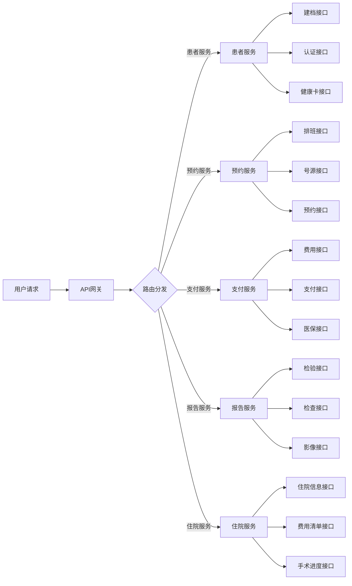

---

## 七、接口版本演进图谱

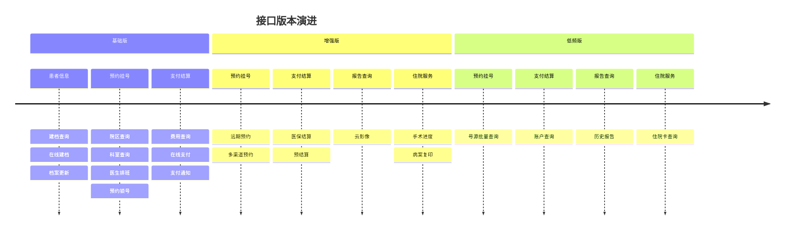

---

## 八、接口分类统计图谱

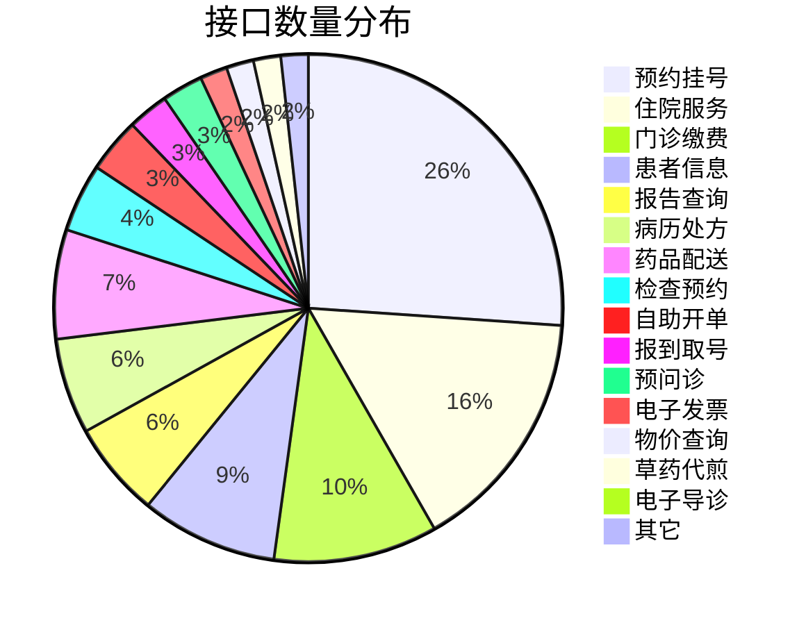

---

## 九、业务场景覆盖图谱

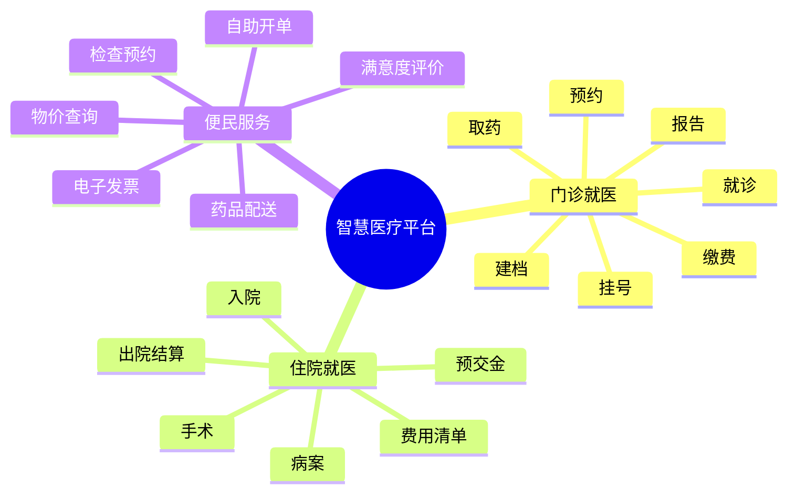

---

*本文档通过Mermaid图表展示智慧医疗服务平台的知识图谱结构*
