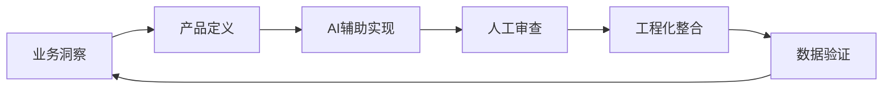

# 🏥 智慧医疗服务平台 - 产品实践

> **姓名**: 叶泽宇  
> **背景**: 医学信息工程 @ 浙江中医药大学  
> **定位**: 熟练使用AI工具的产品实践者 · 技术型业务工程师  
> **核心能力**: 业务洞察 × 产品设计 × AI 工作流

[](https://gitee.com/hjkfyhhhf/internship-showcase)
[](./LICENSE)

> **核心数据**: 3个月独立完成 9 个业务模块 | 大量使用AI工具辅助开发 | 人效提升 2-3 倍  
> **方法论沉淀**: V.A.R.C. AI 开发治理框架 | 从业务洞察到产品落地的完整闭环

---

## 📋 目录

- [🎯 我是谁](#-我是谁)
- [📊 核心产出概览](#-核心产出概览)
- [🧠 AI辅助工作流](#-ai辅助工作流)
- [💼 业务洞察](#-业务洞察)
- [🎨 产品设计](#-产品设计)
- [💻 技术实现](#-技术实现)
- [🛠️ V.A.R.C. 框架](#-varc-框架)
- [🧠 RAC-FLOW 认知增强框架](#-rac-flow-认知增强框架)
- [📞 联系方式](#-联系方式)

---

## 🎯 我是谁

### 差异化定位

我不是传统意义上的"前端开发"，而是 **熟练使用AI工具的技术型产品人**：

```
传统开发: 需求 → 手写代码 → 调试 (100%人力, 慢)
我的方式: 洞察 → 拆解 → AI生成 → 审查整合 → 工程化 (人工核心+AI辅助, 快2-3倍)
```

### 能力三角

| 维度 | 能力 | 证明 |
|------|------|------|
| **业务洞察** | 从DRG支付改革视角理解医院真实诉求 | [用药依从性业务分析](./business-output/business-analysis/用药依从性管理业务分析.md) |
| **产品设计** | 独立完成平台级产品从0到1 | [1700+行PRD文档](./product-output/prd/) |
| **AI工作流** | 整理V.A.R.C.工作流模板治理AI长上下文开发 | [V.A.R.C.框架](./docs/varc-framework/) |

### 核心优势

- ✅ **医学背景**: 理解医疗业务本质，能和医生/医院同频沟通
- ✅ **工程思维**: 知道技术边界，能判断AI产出可用性
- ✅ **AI辅助**: 大量使用AI工具提效，核心逻辑人工把控
- ✅ **闭环能力**: 从业务分析→产品设计→技术实现→数据验证，独立完成

---

## 📊 核心产出概览

### 效率数据

| 指标 | 数据 | 说明 |
|------|------|------|
| **开发周期** | 3个月 | 传统方式预计需6个月+ |
| **业务模块** | 9个完整模块 | 覆盖诊前/诊中/诊后全流程 |
| **AI辅助程度** | **大量** | 核心逻辑人工设计，重复代码AI生成 |
| **人效提升** | **2-3倍** | 同等工作量，时间缩短50%+ |
| **类型覆盖率** | **100%** | 人工把控架构，AI辅助不降低质量 |
| **代码精简率** | **-62%** | 重构优化，从3139行→1190行 |

### 产出结构

```
业务洞察 → 产品设计 → 技术实现 → 治理框架
    ↓         ↓          ↓          ↓
1.5万行   1700+行    2万+行代码   V.A.R.C.
业务文档   PRD文档    AI辅助开发    AI治理
```

---

## 🧠 AI辅助工作流

### 我的工作方式



### 人机分工

| 环节 | 人工负责 | AI负责 | 我的产出 |
|------|----------|--------|----------|
| **业务洞察** | DRG视角分析、医院诉求挖掘、竞品调研 | 资料整理、数据归纳 | [业务分析文档](./business-output/business-analysis/) |
| **产品设计** | 需求优先级、功能架构、核心流程 | 细节描述、格式规范化 | [PRD文档](./product-output/prd/) |
| **技术架构** | 分层设计、类型系统、接口定义 | 代码生成、样板文件 | [架构文档](./ARCHITECTURE.md) |
| **代码实现** | 核心逻辑、边界处理、Review | 大量重复代码AI生成 | [模块代码](./modules/) |
| **质量治理** | 规范制定、关键Review | 自动化检查 | [V.A.R.C.框架](./docs/varc-framework/) |

### AI 使用场景示例

#### 场景1：问卷系统重构

```
人工: 设计分层架构（types→store→api→composables→components）
   ↓
AI:   根据架构生成基础代码（大量辅助）
   ↓
人工: Review业务逻辑、处理边界情况、优化类型定义
   ↓
结果: 3周完成传统需6周的工作量，质量不打折
```

**关键**: 架构是我的设计，AI只是执行者；难点逻辑人工把控，重复劳动AI承担。

#### 场景2：DRG业务分析

```
人工: 从拔牙经历洞察DRG改革对医院的影响
   ↓
AI:   辅助整理DRG政策资料、竞品信息
   ↓
人工: 提炼核心观点、构建分析框架、撰写深度洞察
   ↓
结果: 完成业务分析报告，提出DRG视角洞察
```

**关键**: AI不能替代业务洞察，但能放大洞察的呈现效率。

---

## 💼 业务洞察

### 核心洞察：DRG支付改革下的医院行为转变

基于个人拔牙经历的深度思考，我发现了医疗支付改革对医院行为的根本性影响：

| 维度 | 传统认知（过时） | 现代认知（DRG时代） |
|------|-----------------|-------------------|
| 医院目标 | 患者多复诊 = 多赚钱 | **一次治好 = 避免亏损** |
| 复诊性质 | 收入源 | **成本损耗 + 考核污点** |
| 用药管理 | 可选项 | **必选项（风险控制）** |

> **完整分析**: [用药依从性管理业务分析](./business-output/business-analysis/用药依从性管理业务分析.md)  
> **价值**: 从个人体验升华为系统性业务洞察，提供面向不同决策人的话术建议

### 竞品分析方法论

完成了医疗信息化行业完整的竞品分析，包含：

- **三类竞品对比**: 平台型（微医）、医院共建型（卫宁/创业）、垂直创新型（本产品）
- **TCO成本分析**: 3年总拥有成本量化对比（本产品85万 vs 卫宁169万）
- **定位矩阵**: 功能完整性 vs 投入成本的可视化定位

> **完整报告**: [竞品分析与方案优势](./business-output/competitive-analysis/竞品分析与方案优势.md)

### 知识图谱构建

构建了医疗业务9维知识图谱，涵盖：
- 8大核心业务域（患者服务、预约挂号、诊前服务、支付结算等）
- 业务流程时序图
- 接口依赖关系（116个接口分类统计）
- 系统交互拓扑

> **查看图谱**: [知识图谱](./business-output/knowledge-graph/知识图谱.md)

---

## 🎨 产品设计

### 平台级产品设计

独立完成智慧医疗服务平台从0到1的产品设计：

| 文档 | 定位 | 规模 | 内容亮点 |
|------|------|------|----------|
| [产品设计版PRD](./product-output/prd/prd-smart-medical-platform.md) | 面向设计/开发 | 816行 | 设计规范+交互规范+8个核心页面详细设计 |
| [功能规格版PRD](./product-output/prd/prd-functional-specification.md) | 面向实施 | 901行 | 43个模块+200+页面路径+组件库说明 |

### 设计体系完整性

- **设计规范**: 色彩系统（品牌色/功能色/中性色）、字体规范（40rpx-24rpx梯度）、间距规范（8rpx基线）
- **交互规范**: 转场动画（300ms标准）、手势热区（44pt最小）、反馈机制（Toast/Loading/Dialog）
- **性能指标**: 首页首屏<2s、包体积<4MB、接口响应<800ms

### 业务闭环覆盖

设计的平台覆盖患者就医完整旅程：

```
诊前: 智能预问诊 → 预约挂号 → 排队叫号
        ↓
诊中: 门诊缴费 → 报告查询 → 用药管理
        ↓
诊后: 住院服务 → 病案复印 → 电子发票 → 健康档案
```

**16个核心业务场景**详细分析: [业务案例](./business-output/business-cases/业务案例.md)

---

## 💻 技术实现

### AI辅助开发成果

技术实现是产品落地的保障，我采用 **AI辅助+人工把控** 的模式：

| 模块 | AI生成占比 | 人工核心工作 | 成果 |
|------|-----------|-------------|------|
| **问卷重构** | 大量 | 架构设计、类型定义、边界处理 | 901行→380行，-58%精简 |
| **DRG结算** | 55% | 复杂业务逻辑、状态流转 | 36个文件，10k+行 |
| **用药管理** | 65% | 表单交互设计、数据流 | 完整模块实现 |

### 架构设计（人工设计）

```
modules/
├── types/           # 类型定义层（人工设计，AI生成）
├── store/           # 状态管理层（人工设计核心逻辑）
├── api/             # API接口层（AI生成样板）
├── composables/     # 业务逻辑层（人工设计，AI辅助）
├── components/      # 组件层（AI生成基础，人工优化）
├── utils/           # 工具函数层（AI生成常用函数）
└── pages/           # 页面层（AI生成基础结构）
```

### 代码质量（人工把控）

- ✅ **TypeScript 严格模式**: 类型覆盖率100%，0 any类型
- ✅ **设计模式**: Adapter、状态机等9种模式应用
- ✅ **代码精简**: 重构后-62%，从3139行→1190行

> **技术细节**: [架构设计文档](./ARCHITECTURE.md)  
> **重构案例**: [问卷重构分析](./modules/questionnaire-refactor/ANALYSIS.md)

---

## 🛠️ V.A.R.C. 框架

### 为什么开发这个框架？

在AI辅助开发过程中，我遇到了行业共性痛点：

| 痛点 | 我的解决方案 |
|------|-------------|
| AI"失忆"（新会话忘记之前约束） | **V**erifiable - 约束继承机制 |
| 跨会话决策无法追溯 | **A**uditable - 会话链追踪 |
| AI偏离设计方向 | **R**ecoverable - 恢复协议 |
| 多线探索混乱 | **C**onversational - 分叉管理 |

### 框架核心价值

**V.A.R.C.** (Verifiable · Auditable · Recoverable · Conversational) 是一套 **AI开发治理工作流**：“}]} functions.StrReplaceFile:75  {

```
核心理念: 对话是临时代码分支，必须像管理代码一样管理对话状态
```

### 框架特性

- ✅ **约束继承**: 新会话自动继承设计约束，防止偏离
- ✅ **会话链**: 跨对话的完整决策链路追踪
- ✅ **恢复协议**: AI"失忆"时的标准化恢复流程
- ✅ **自动化工具**: PowerShell/Bash脚本支持全流程

### 使用方式

```powershell
# 初始化项目AI会话
./varc-init.ps1 -ProjectName "medical-platform"

# 保存当前会话状态
./varc-save.ps1 -Message "完成问卷模块重构"

# 查看会话历史链
./varc-status.ps1
```

> **完整文档**: [V.A.R.C. 框架文档](./docs/varc-framework/VARC-README.md)  
> **快速开始**: [QUICKSTART](./docs/varc-framework-v2/QUICKSTART.md)  
> **架构说明**: [ARCHITECTURE-v2](./docs/varc-framework-v2/ARCHITECTURE-v2.md)

---

## 🧠 RAC-FLOW 认知增强框架

### 为什么开发这个框架？

在长期使用 AI 辅助工作的过程中，我发现一个核心问题：

> **AI 的默认输出是"平均化"的——它倾向于生成最安全、最通用的答案，而非最有洞察力的答案。**

为了突破这个局限，我总结了 **RAC-FLOW** 五步法：

| 步骤 | 核心动作 | 解决问题 |
|------|---------|----------|
| **R**eflective | 元认知注入 | 避免 AI 盲目生成，先建立思考框架 |
| **A**dversarial | 对抗验证 | 红队攻击，暴露逻辑漏洞 |
| **C**ognitive | 极端约束 | 通过限制迫使 AI 进入抽象层级 |

### 实战验证

该框架已在以下场景验证：

- ✅ [本仓库 README 的产品定位重构](./docs/rac-framework/examples/readme-optimization.md)
- ✅ [DRG 医疗业务深度分析](./docs/rac-framework/examples/business-analysis.md)
- ✅ [问卷系统架构评审](./docs/rac-framework/examples/architecture-design.md)

> **完整文档**: [RAC-FLOW 框架（基础版）](./docs/rac-framework/RAC-FLOW.md)  
> **进阶协议**: [RAC-Protocol-v1（进阶版，含去讨好化机制）](./docs/rac-framework/RAC-Protocol-v1.md)  
> **快速开始**: [框架 README](./docs/rac-framework/README.md)

---

## 🎯 我能带来的价值

### 对团队的价值

| 场景 | 传统方式 | 我的方式 |
|------|----------|----------|
| **需求分析** | 产品经理写PRD → 开发评审 → 反复沟通 | 我直接产出可执行的PRD+原型 |
| **技术实现** | 开发估算2周 | AI辅助+我审查，1周完成 |
| **业务理解** | 开发不懂业务，产品不懂技术 | 我双向翻译，减少沟通损耗 |
| **AI工具链** | 团队还在用手写代码 | 我引入AI工作流，整体提效 |

### 适合的岗位

- **AI产品经理**: 懂技术边界，会用AI放大能力
- **业务架构师**: 懂业务+技术，能设计系统级方案
- **解决方案架构师**: 懂医疗+AI，能做垂直领域方案

---

## 📞 联系方式

- **作者**: 叶泽宇
- **邮箱**: 2163004931@qq.com
- **仓库**: https://gitee.com/hjkfyhhhf/internship-showcase
- **更新时间**: 2025年3月

---

## 📝 声明

> ⚠️ **隐私声明**: 本仓库仅展示产品方法论和业务洞察，不包含公司业务敏感信息、API地址、真实数据等。
>
> 🤖 **AI使用声明**: 本项目大量使用AI工具辅助开发，我能解释每行核心代码的逻辑。AI是效率工具，我的价值在于业务判断和架构设计。

---

**如果这个项目对你有启发，欢迎 ⭐ Star 支持！**
