# 和仁科技患者端项目技术沉淀

> 医疗信息化前端开发实践 | 患者端全流程业务 | 多租户 SaaS 架构

## 📋 项目简介

杭州和仁科技股份有限公司患者端互联网医院产品，覆盖患者从**挂号→就诊→支付→取药→住院**全流程的线上服务。

**核心挑战**：
- 一套代码支持 8 家医院，各医院功能差异大（配置化架构）
- 医疗数据安全合规（等保三级、数据加密）
- 复杂业务流程的模块化设计

---

## 🏥 患者端业务流程

### 完整就诊流程

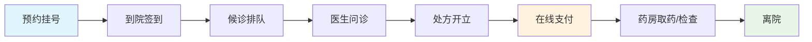

### 核心业务模块关系

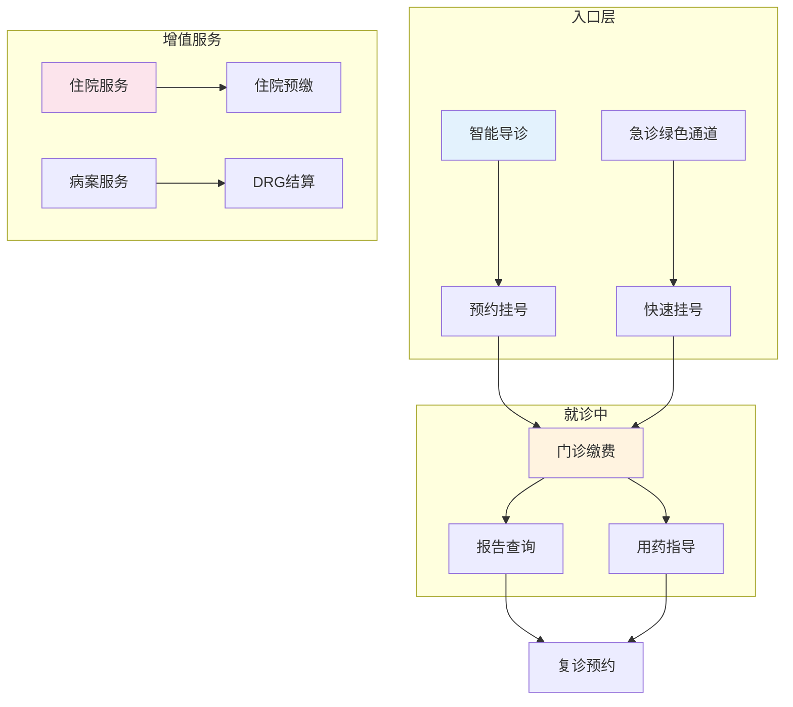

---

## 🏗️ 系统架构

### 整体架构

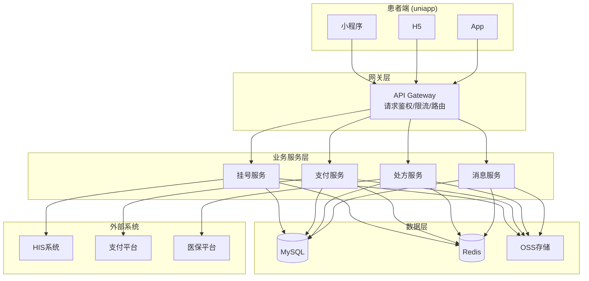

### 前端模块架构

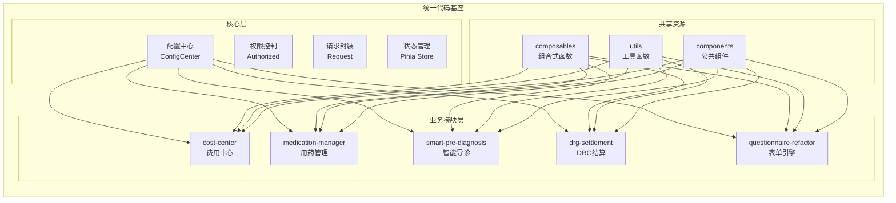

---

## 📦 核心业务模块

### 1. 预约挂号模块

**业务流程**：

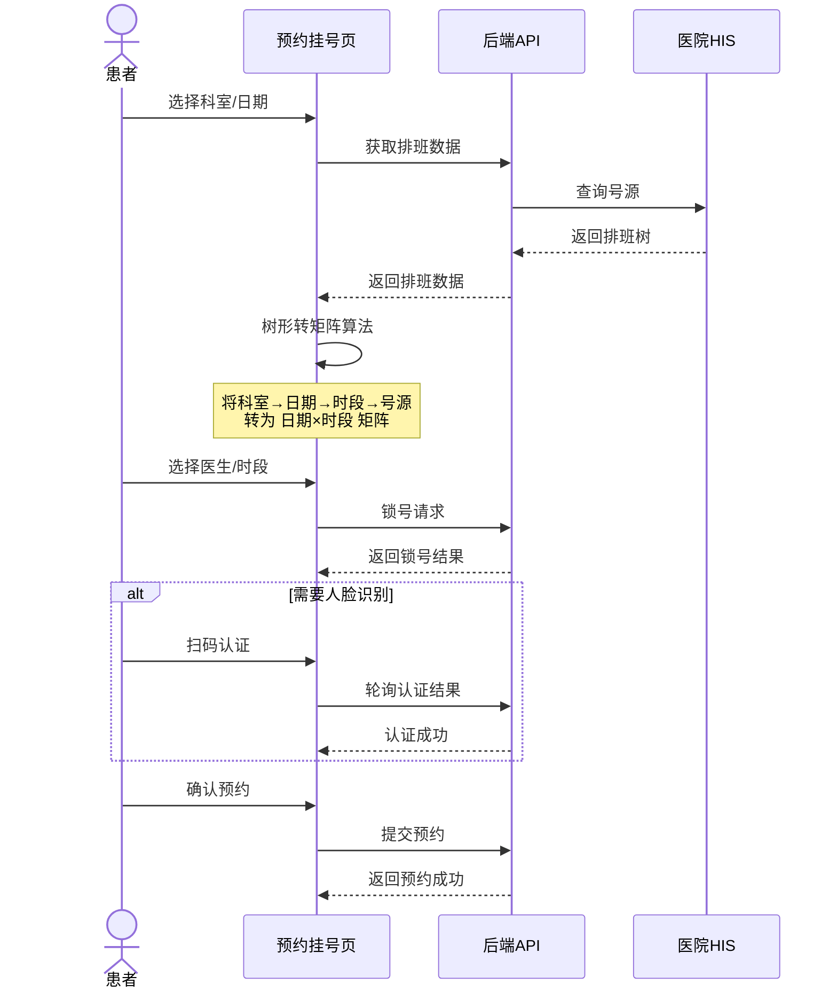

**技术实现**：
- **数据转换**：后端返回树形结构（科室→日期→时段→号源），前端通过 `reduce` 转为矩阵表格
- **双模式展示**：支持"按日期选医生"和"按医生选日期"两种交互模式
- **号源锁定**：预约前锁号 15 分钟，超时释放

---

### 2. 费用中心模块

**支付流程**：

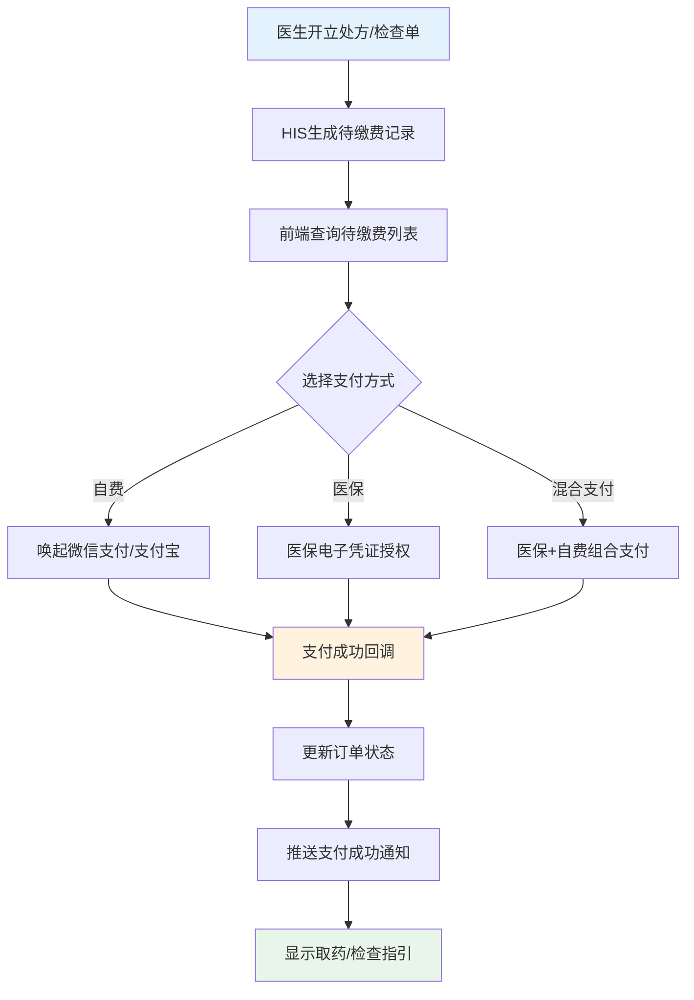

**状态机设计**：

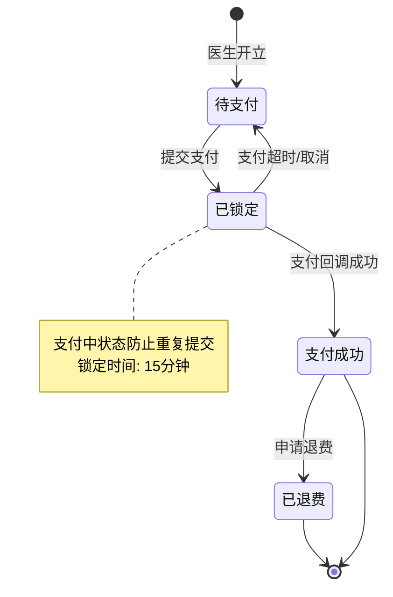

---

### 3. 智能预问诊模块

**导诊流程**：

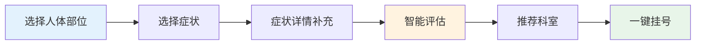

**人体图交互架构**：

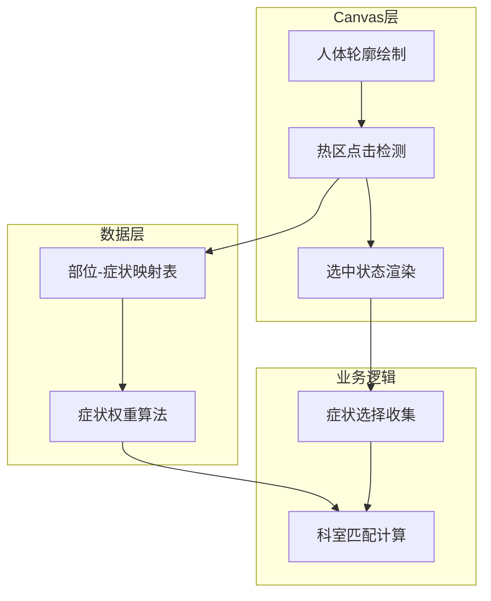

---

### 4. DRG 结算模块

**病案分组流程**：

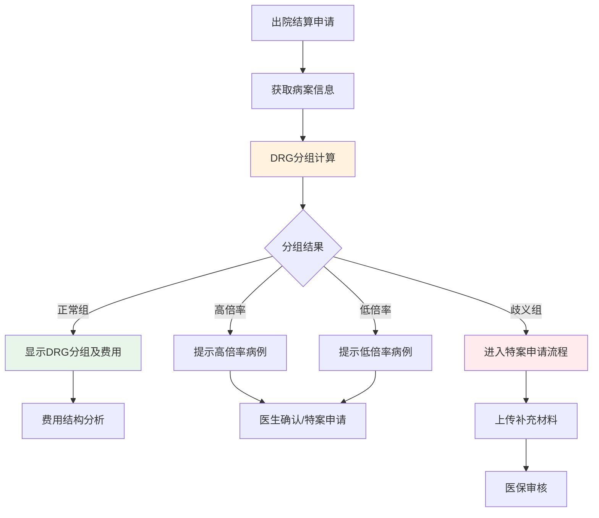

---

## 🎯 核心技术方案

### 配置化架构（多租户支持）

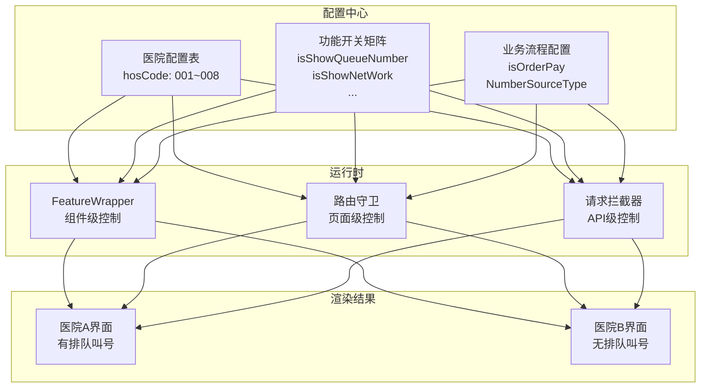

**核心代码**：

```typescript
// 功能开关组件
<template>
  <slot v-if="isEnabled" />
  <slot v-else name="fallback" />
</template>

// 使用示例
<FeatureWrapper featureKey="isShowQueueNumber">
  <QueueNumberCard />
</FeatureWrapper>
```

---

### 数据安全架构

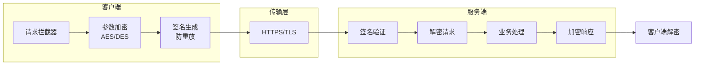

---

## 📂 项目结构

```
temp-repo/
├── 01-Project-Docs/              # 项目文档
│   ├── 01-Methodology/           # 方法论框架
│   ├── 02-Architecture/          # 架构设计
│   └── 03-Business/              # 业务分析
│
├── 02-Core-Assets/               # 核心技术资产
│   ├── tech-articles/            # 5篇技术沉淀
│   │   ├── 01-预约挂号排班算法.md
│   │   ├── 02-人脸识别轮询机制.md
│   │   ├── 03-多租户配置化架构.md
│   │   ├── 04-安全加密通信体系.md
│   │   └── 05-灵活权限控制架构.md
│   └── 项目总结终版.md
│
├── 03-Source-Code/               # 源代码
│   ├── modules/                  # 8个业务模块
│   │   ├── cost-center/          # 费用中心
│   │   ├── medication-manager/   # 用药管理
│   │   ├── smart-pre-diagnosis/  # 智能导诊
│   │   ├── drg-settlement/       # DRG结算
│   │   └── ...
│   ├── shared/                   # 共享资源
│   └── examples/                 # 架构示例
│
└── 04-Tools/                     # 工具脚本
```

---

## 🚀 快速开始

### 环境要求

- Node.js >= 16
- npm >= 8

### 安装运行

```bash
# 安装依赖
npm install

# H5 开发
npm run dev:h5

# 微信小程序
npm run dev:mp-weixin
```

### 查看示例

```bash
# 配置中心示例
cd 03-Source-Code/examples/config-center
npm run demo
```

---

## 📊 项目数据

| 指标 | 数值 |
|-----|------|
| 业务模块 | 8 个完整模块 |
| 覆盖医院 | 8 家（同一套代码部署）|
| 核心流程 | 挂号→就诊→支付→取药→住院全流程 |
| 技术沉淀 | 5 篇架构文档 |

---

**维护者**：叶泽宇 | 浙江中医药大学 · 医学信息工程  
**更新时间**：2025-03-31
